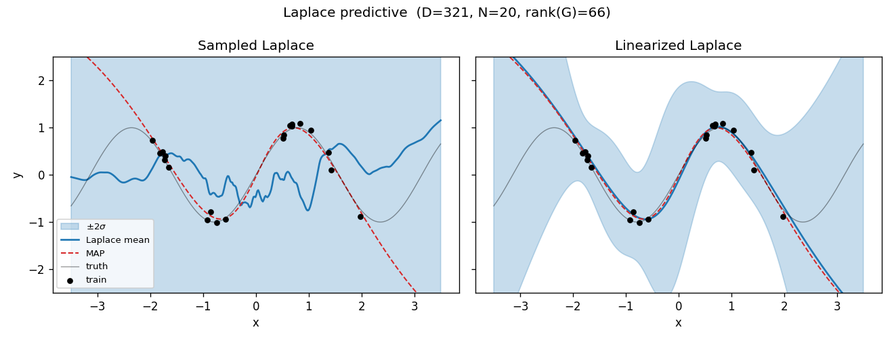
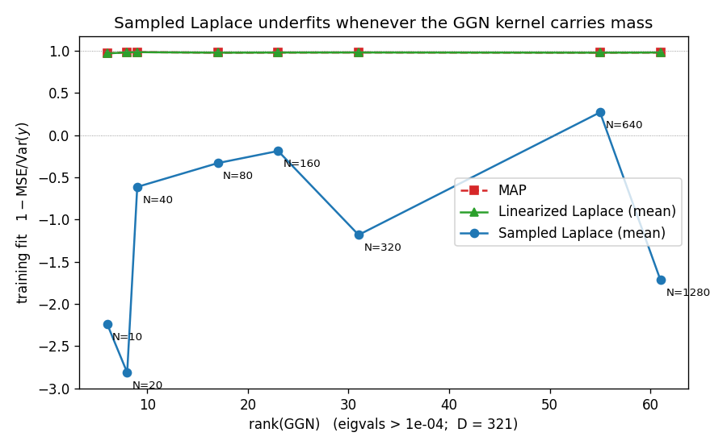
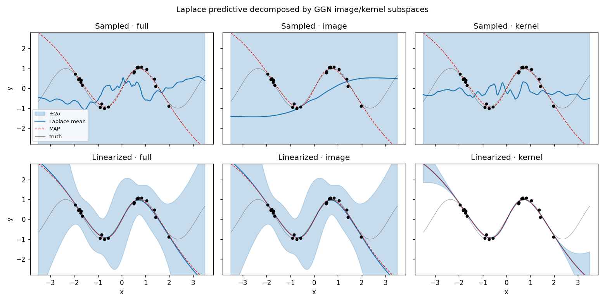

# Laplace reparameterization invariance — reproduction

Reproduction of the diagnostic experiments from
[Roy, Miani et al., *Reparameterization invariance in approximate Bayesian inference*, NeurIPS 2024](https://arxiv.org/abs/2406.03334).

The paper's diagnosis: sampled Laplace approximations underfit in
overparametrized neural networks because posterior mass lands in
`ker(GGN)`, a subspace along which the *linearized* predictive is
invariant but the nonlinear network is not.

All code is small JAX/Flax, CPU-only. Each experiment produces a
figure in `figures/`.

## Quickstart

```bash
python -m venv .venv && source .venv/bin/activate
pip install -r requirements.txt
python -m experiments.exp1_basic
python -m experiments.exp2_rank
python -m experiments.exp3_decomposition
```

## What each experiment shows

### Experiment 1 — Sampled vs linearized predictive
`python -m experiments.exp1_basic` → `figures/01_sampled_vs_linearized.png`

Train a 2-layer tanh MLP on 20 points from a sine with a gap, then
compare the sampled and linearized Laplace predictives.



Sampled Laplace (left) has uncertainty everywhere, including on
training data — the "underfitting" signature. Linearized Laplace
(right) tightly tracks MAP on the training data and expands in the
gap and extrapolation tails.

### Experiment 2 — Rank(GGN) vs training fit
`python -m experiments.exp2_rank` → `figures/02_rank_vs_underfitting.png`

Sweep `N ∈ {10, …, 1280}`. For each `N`, fit MAP, compute rank(GGN),
and measure the training fit (`1 − MSE/Var(y)`) of MAP, the
linearized-Laplace mean, and the sampled-Laplace mean.



MAP and linearized Laplace sit together at ≈0.98 as soon as there is
enough data. Sampled Laplace stays negative (worse than the
constant-mean baseline) across the entire sweep.

An observation that extends the paper's analysis: in tanh MLPs,
sampled Laplace does not catch up to MAP even at `N = 1280 ≫ rank(G)`.
The kernel carries *structural* components from neuron permutation
and tanh sign-flip symmetries — invariances of the architecture
itself, not of the data — which persist regardless of dataset size.
The paper's rank-deficiency story (`dim ker(G) ≥ D − NO`) captures
the dimensional contribution but not the architectural one. An open
question is whether the paper's proposed Laplace diffusion, which
operates on the non-kernel manifold `P_w`, handles these structural
symmetries automatically or only the dimensional kernel.

### Experiment 3 — Kernel vs image decomposition (payoff figure)
`python -m experiments.exp3_decomposition` → `figures/03_kernel_image_decomposition.png`

Eigendecompose the GGN, project posterior samples onto its image and
kernel subspaces, and compute predictives for each projection under
both sampled and linearized Laplace.



Bottom-right is the key panel: the linearized predictive collapses to
a thin band around MAP when samples live entirely in `ker(GGN)`, as
predicted by `f_lin(w, x*) = f(w_MAP, x*) + J(x*)(w − w_MAP)` with
`J(x*)v = 0` for `v ∈ ker(GGN)`. The top-right panel — the same
projection, but evaluated through the *nonlinear* network — has the
opposite behavior: massive uncertainty. Numerically, mean predictive
variance from the kernel subspace is `1.578·10²` (sampled) vs
`3.677·10⁻²` (linearized), a ratio of `4.3·10³`.

## Layout

```
src/
  model.py       MLP, toy data, MAP trainer  (given)
  laplace.py     GGN, posterior cov, sampling, predictives
experiments/
  exp1_basic.py
  exp2_rank.py
  exp3_decomposition.py
figures/         output plots
```

## Conventions

Sum-scale Laplace with Gaussian likelihood (σ=1) and Gaussian prior
`N(0, 1/α I)`. Posterior `N(w_MAP, (G + α I)^{-1})` with
`G = J.T @ J` and `J ∈ R^{N×D}` the stacked per-sample Jacobian of
the scalar-output network. Default `α = 0.1`, hidden sizes `(16, 16)`,
`D = 321` parameters.

## Not implemented

The paper's Riemannian-geometry-based Laplace diffusion (their
proposed fix) is out of scope — this repo reproduces their diagnostic
experiments only.

## Discussion

The reproduction confirms the paper's core mechanism: posterior mass
in `ker(GGN)` produces functional variation in the nonlinear
predictive but is absorbed by `f_lin`'s construction. Experiment 3
is the cleanest evidence — the kernel-projected sampled predictive
has variance orders of magnitude larger than its linearized
counterpart, which collapses to a thin band around MAP by
construction.

Experiment 2 reveals a subtlety the paper does not address:
architectural symmetries (permutation invariance of hidden units,
tanh sign-flip) contribute structural kernel components that are
independent of dataset size. Rank deficiency from overparametrization
(`dim ker ≥ D − NO`) is necessary but not sufficient to explain
persistent underfitting in symmetric architectures.

This connects to a natural extension: does the Riemannian diffusion
on `(P_w, GGN⁺)` proposed in §5 of the paper account for structural
symmetries, or does it only quotient out the dimensional kernel?
The quotient space `P = R^D / ∼` is defined by training-data
invariance, which should in principle include both — but the `GGN⁺`
pseudo-inverse that drives the diffusion is computed from data
Jacobians and may not "see" global architectural symmetries. An
experimental check: compare Laplace diffusion samples on a tanh MLP
vs. a sign-flip-broken variant (e.g. mixed tanh/ReLU).
# laplace_reparam
